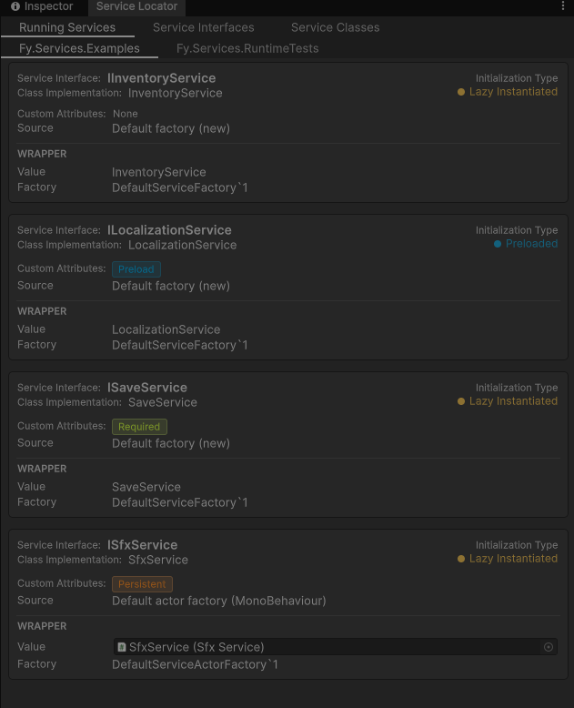

# Fy Service Locator

> "Provide a global point of access to a service without coupling users to the concrete class that implements it."
>
> — Robert Nystrom, *Game Programming Patterns*

## About the package

A service locator is a central registry for shared systems: audio, save, inventory, and so on. Instead of creating those systems yourself or dragging references around in the inspector, you ask the locator for an interface and it hands you the implementation.

## Install

Package Manager → Add package from git URL:

```
https://github.com/vgArchives/ServiceLocator.git?path=/Packages/com.fy.services#0.1.0
```

## How to use

A service is composed of two things: an interface that extends `IService`, and a class that implements it. The registration happens in runtime, the package scans your assemblies that references iService at startup, pairs the interface with its implementation, and prepares a factory for it's initialization.

### A pure C# service

The common case: just a class behind an interface.

```csharp
public interface IInventoryService : IService
{
    void Add(string item, int amount = 1);
    int Count(string item);
}

public sealed class InventoryService : IInventoryService
{
    // your service logic implementation...

    public void Dispose() { }
}
```

When you need it you just call:

```csharp
if (ServiceLocator.TryGet(out IInventoryService inventory))
{
    inventory.Add("Potion", 3);
}
```

The class is created with `new` on first request and reused afterwards. `Dispose` runs when the service is replaced or when play mode ends, so use it to release anything you allocated.

`TryGet` returns `false` when nothing can provide the service; use it for anything optional and check the result. For a service the game cannot run without, mark the interface `[RequiredService]` and use `GetChecked`, which returns the instance or throws if it is missing:

```csharp
[RequiredService]
public interface ISaveService : IService { }

ISaveService save = ServiceLocator.GetChecked<ISaveService>();
```

### A MonoBehaviour service

Use this when the service needs to live on a GameObject, for example because it uses an `AudioSource`, runs coroutines, or wants `Update`/`OnDestroy`. Implement the interface on a MonoBehaviour:

```csharp
public interface ISfxService : IService
{
    void PlaySound(string clipName);
}

public sealed class SfxService : MonoBehaviour, ISfxService
{
    public void PlaySound(string clipName) { }

    public void Dispose() { }
}
```

The sytem will notice the type is a MonoBehaviour and, on first request, reuses an instance already in the scene or creates a GameObject for it.

```csharp
if (ServiceLocator.TryGet(out ISfxService sfx))
{
    sfx.PlaySound("Explosion");
}
```

### Attributes

Add these to a service interface or class to change how it behaves:

| Attribute | Put it on | What it does |
| --- | --- | --- |
| `[RequiredService]` | interface | Marks the service as always needed; enables `GetChecked` and a startup check. |
| `[DynamicService]` | interface | Lets you replace the instance at runtime, disposing the old one. |
| `[PreloadService]` | class | Builds the service before the first scene loads instead of on first use. |
| `[AbstractService]` | interface | Hides a shared base interface so the concrete ones are registered instead. |
| `[DisableDefaultFactory]` | class | Skips the automatic factory so you can register your own. |
| `[PersistentService]` | class (MonoBehaviour) | Keeps the service alive across scene loads. |
| `[ShowInServiceWindow]` | field / property | Shows the member's value in the editor window. |

### Manual registration

When a service needs custom construction, register it yourself during startup instead of relying on the default factory:

```csharp
ServiceLocator.SetService<IFooService>(new FooService(config));
// or provide a factory that builds it on demand
ServiceLocator.SetFactory<IFooService>(new FooFactory());
```

## Lifecycle

- **Startup, before the first scene.** The `ServiceAutoLoader` scans your assemblies, pairs each interface with its implementation, and registers a default factory. Services marked `[PreloadService]` are built at startup; everything else is lazily initiated when you first call it.
- **First request.** `TryGet` or `GetChecked` builds the service through its factory and caches it. Every later request returns the same instance.
- **Replacement.** Setting a service marked as `[DynamicService]` in runtime disposes the old instance before storing the new one.
- **Play mode ends.** Every service is disposed and the registry is cleared, so nothing leaks between runs.

To see the current state of services, open **Window → Fy → Service Locator**. In Play Mode the window lists every registered service and whether each one is resolved, lazy, or empty, along with its attributes. Mark a field or property with `[ShowInServiceWindow]` to watch its value change live while the game runs.



## Examples

Import the **Service Examples** sample from the package's page in the Package Manager. Each example is a small interface, its implementation, and a MonoBehaviour you can drop on a GameObject to see it in action.
